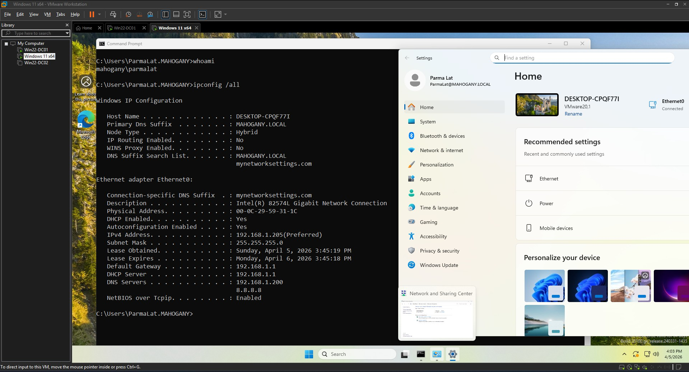
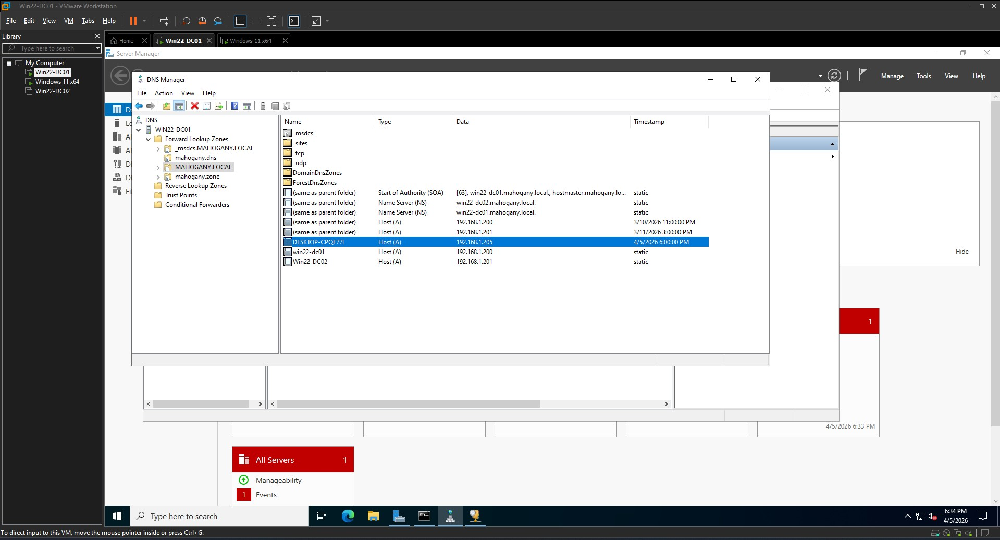

# Windows Server Lab

## Overview
A home lab with 2 Domain Controllers, DNS, DHCP, and a Windows 11 domain-joined client.

## Network Topology

## Screenshots
### Active Directory Structure
Domain Controllers

Users

Computers

GPO for User

#### Windows 11 Client

### DHCP Pool

### DNS Pool

### GPO for Firewall and general config
Configs

Firewall

📄 [View Firewall GPO Rules](configs/firewal/Firewall.md)

## Technologies Used
- VMWare Workstation Pro 17
- Windows Server 2022
- Active Directory Domain Services (AD DS)
- DNS Server
- DHCP Server
- Windows 11 Client

## Troubleshooting 
 * Solve DNS not showing on Win11 Client

## Future changes
* Stop using Administrator user
* Add another client
* Push more GPO's
